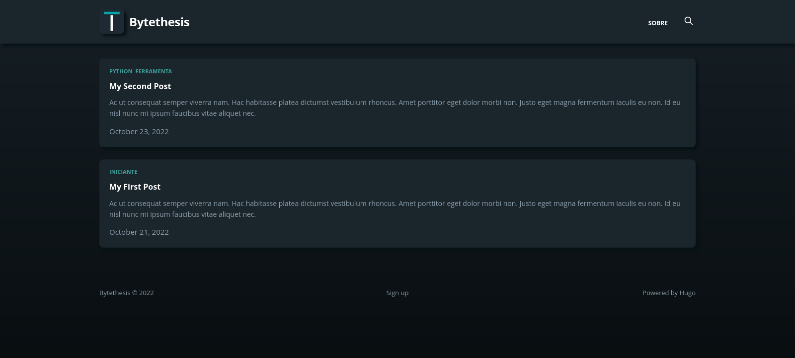
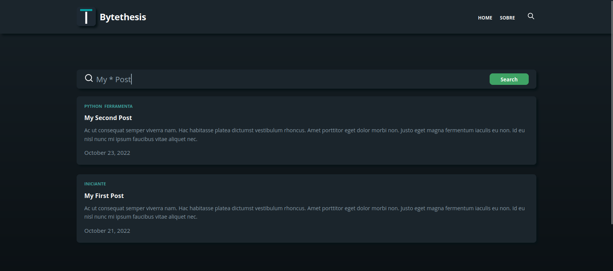

</img>

# ByteThesis

Bytethesis é um site, blog sobre programação feito usando o <a href="https://github.com/gohugoio/hugo" target="_blank">Hugo</a> Framework.

Acesse https://bytethesis.one

</img>
</img>

## Características
- Tema próprio
  - Tags
  - Modo Dark
- Página principal que lista todos os posts
- Página /categories que lista todas as categorias/tags
- Página /categories/{category} que lista todos os posts de uma categoria
- Página sobre
- Página de artigo
- Responsivo
- Página de pesquisa com lunr.js

